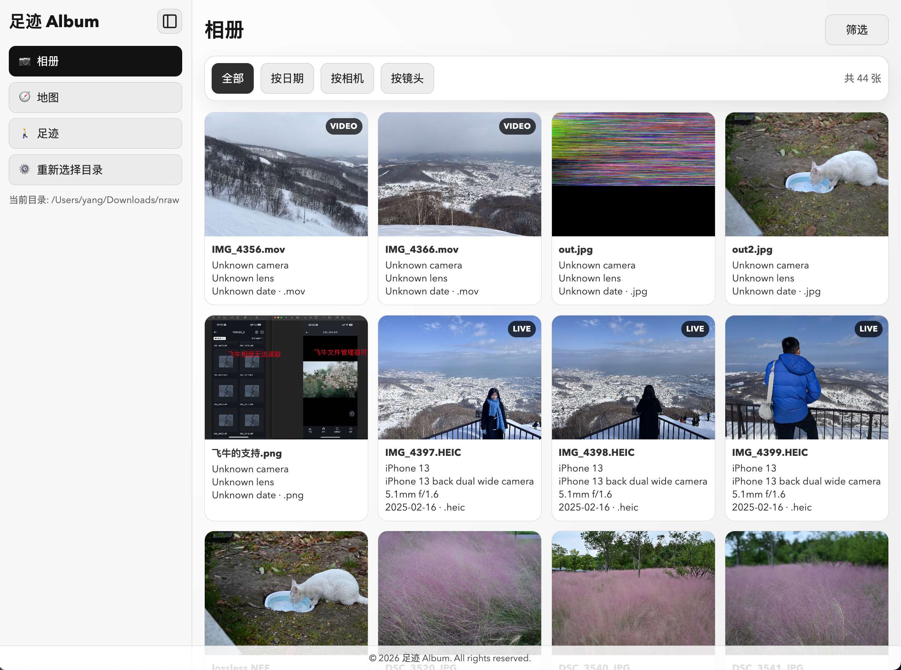
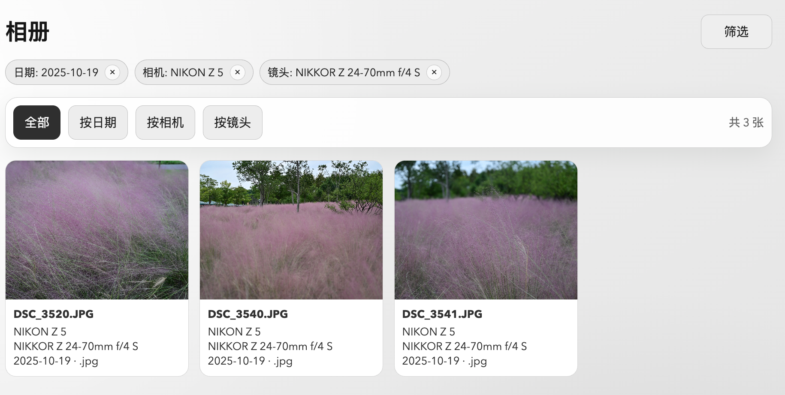
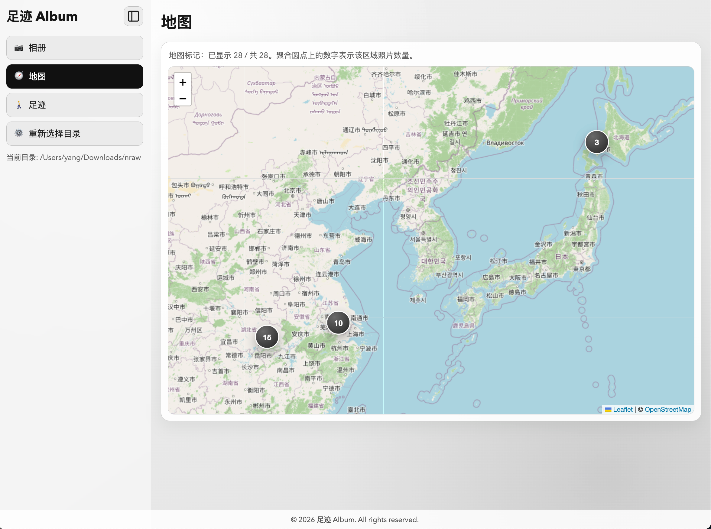
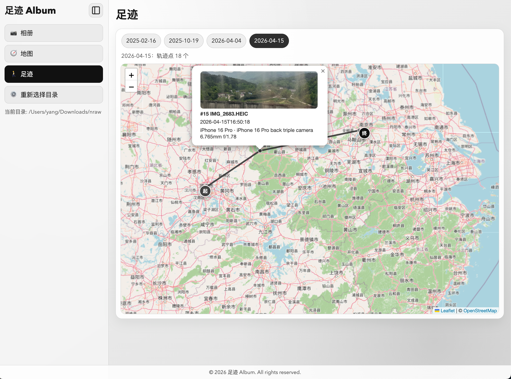

# 足迹 Album

> pynraw = Python + Nikon RAW

## 功能

- 多格式扫描：
  - 常见图片（JPEG/PNG/TIFF/WebP/GIF/HEIC...）
  - 支持Live Photo
  - RAW（NEF/CR2/ARW/DNG/ERF...）
  - 视频（MOV+MP4+AVI+MKV...）
- 元数据抽取：拍摄日期、相机型号、镜头信息、GPS 经纬度
- 多视图展示：
  - 网格平铺、按日期分组、按相机分组
  - 地图页：展示照片地理分布点位
  - 足迹页：展示某个日期的拍照轨迹

## 截图









## TODO

- [ ] 目前仅支持本地文件扫描，计划支持SMB/FTP等远程文件协议
- [ ] 目前存在重复加载、效率低等问题，等待优化

## 启动

### 后端

```bash
uv sync
uv run python backend/app.py
```

默认：`http://127.0.0.1:5001`

### 前端

```bash
cd frontend
npm install
npm run dev
```

默认：`http://127.0.0.1:3000`

如果后端不是 `127.0.0.1:5001`，请修改 `frontend/.env.local` 中的 `NEXT_PUBLIC_API_BASE`。

> [!NOTE]  
> 几乎所有代码都由codex完成，AI太强了😭
